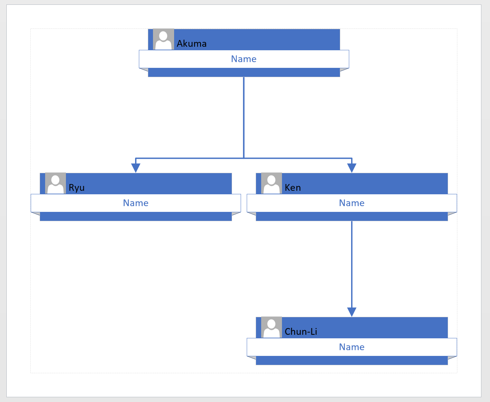

# Org charts from XML

`Out-VisioApplication` needs an attached Visio application; otherwise it throws "A Visio Application Instance is not attached". The org chart is drawn into a new document created from the org chart template, not onto the current page.

```
$xmldoc = @"
<orgchart>
  <shape id="0" name="Akuma" />
  <shape id="1" name="Ryu" parentid="0"/>
  <shape id="2" name="Ken" parentid="0"/>
  <shape id="3" name="Chun-Li" parentid="2"/>
</orgchart>
"@


$filename = "d:\model.xml"
$xmldoc | out-file $filename
$model = Import-VisioModel -Filename $filename
$model | Out-VisioApplication

```


