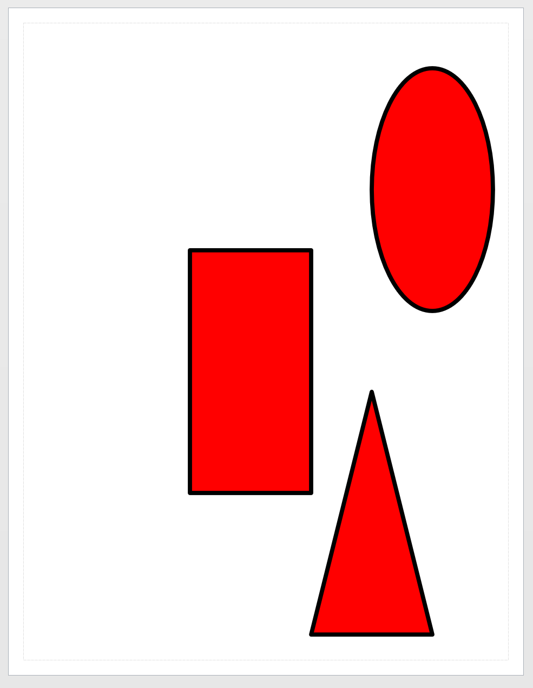

# Format shapes with cells

### Formatting the Shapes that were dropped

The example below sets all the shapes to have a consistent width, height, fill color, and line weight.

```
$shape_cells = New-VisioShapeCells
$shape_cells.XFormWidth = 2
$shape_cells.XFormHeight = 4
$shape_cells.FillForeground = "rgb(255,0,0)"
$shape_cells.LineWeight = "5 pt"

$basic_u = Open-VisioDocument "basic_u.vss"
$masters = Get-VisioMaster -Name "Rectangle","Triangle","Circle"  -Document $basic_u
$points = @(
    New-VisioPoint 4 5
    New-VisioPoint 6 1
    New-VisioPoint 0 0
    )
$shape = New-VisioShape -Master $masters -Position $points -Cells $shape_cells
```



If you want to format each shape separately, that is possible also by passing in multiple shape cells objects

```


$shape_cells1 = New-VisioShapeCells
$shape_cells2 = New-VisioShapeCells
$shape_cells3 = New-VisioShapeCells

$shape_cells = @( 
    $shape_cells1, $shape_cells2, $shape_cells3
)

$shape_cells1.XFormWidth = 2
$shape_cells1.FillForeground = "rgb(255,255,0)"
$shape_cells2.XFormHeight = 4
$shape_cells2.FillForeground = "rgb(0,0,255)"
$shape_cells3.FillForeground = "rgb(255,0,0)"
$shape_cells3.LineWeight = "5 pt"

$basic_u = Open-VisioDocument "basic_u.vss"
$masters = Get-VisioMaster -Name "Rectangle","Triangle","Circle"  -Document $basic_u
$points = @(
    New-VisioPoint 4 5
    New-VisioPoint 6 1
    New-VisioPoint 0 0
    )
$shape = New-VisioShape -Master $masters -Position $points -Cells $shape_cells

```

.png>)

Many common formatting options are available in the ShapeCells object returned by `New-VisioShapeCells`. To find see all the properties use the following command

```
$shape_cells = New-VisioShapeCells
$shape_cells | select *
```
