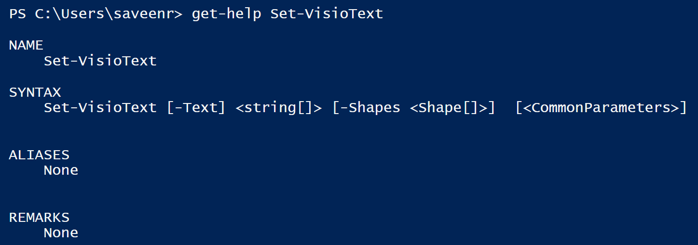

# Get help for a cmdlet

`Get-Help` allows you to find basic information about the syntax for each cmdlet

```text
Get-Help Set-VisioText
```



###  <a id="troubleshooting-with-the--verbose-flag"></a>


