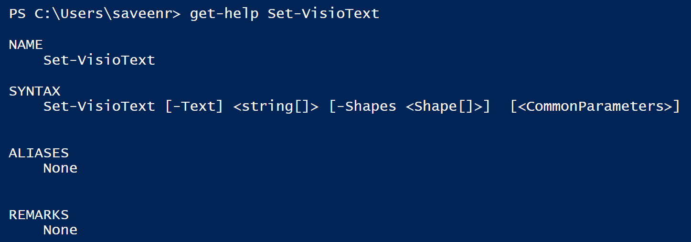

# Get help for a cmdlet

PowerShell's built-in `Get-Help` works on every cmdlet in the module. The default form gives you a one-screen summary: description, syntax, parameter list.

```powershell
Get-Help Set-VisioText
```



### Just the syntax

For a quick reminder of the parameter signature, ask for the syntax block:

```powershell
Get-Help New-VisioShape -Syntax
```

### Worked examples

Pages here on the site already have worked examples, but `-Examples` will dump them inline at the prompt:

```powershell
Get-Help Lock-VisioShape -Examples
```

### Full reference

For everything `Get-Help` knows about a cmdlet (description, every parameter's type / position / pipeline behavior, examples, notes, related links):

```powershell
Get-Help Set-VisioCustomProperty -Full
```

### Listing the module's cmdlets

To see everything the module exports rather than help for a specific one, use `Get-Command`:

```powershell
Get-Command -Module Visio | Sort-Object Noun, Verb
```

See [List cmdlets](list-cmdlets.md) for more on this.
