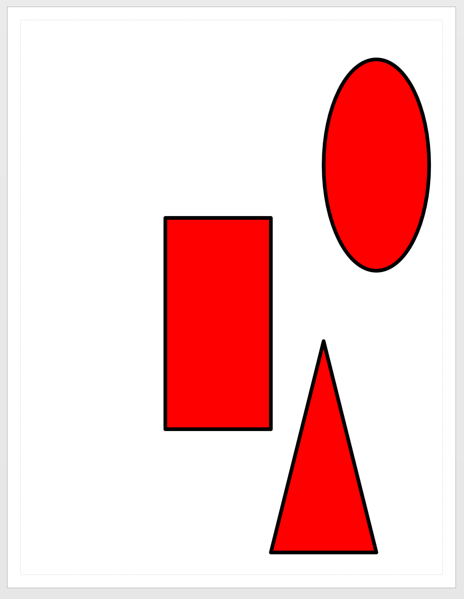

# Masters and Stencils


#### Masters and stencils <a id="masters-and-stencils"></a>

The recommended way to get shapes on a page is to drop a **master** from a **stencil**.

**Dropping a master**

The following code shows the simplest case. It drops a "Rectangle" shape into the current page at position 4,5.

```text
$basic_u = Open-VisioDocument "basic_u.vss"
$master = Get-VisioMaster "Rectangle" -Document $basic_u
$points = New-Object VisioAutomation.Geometry.Point(4,5)
$shape = New-VisioShape -Master $master -Position $points
```

**Dropping a master multiple times - the simple recommended and much faster way**

```text
$basic_u = Open-VisioDocument "basic_u.vss"
$master = Get-VisioMaster "Rectangle" -Document $basic_u
$points = @(
    New-Object VisioAutomation.Geometry.Point(4,5)
    New-Object VisioAutomation.Geometry.Point(6,1)
    New-Object VisioAutomation.Geometry.Point(0,0)
    )
$shapes = New-VisioShape -Master $master -Position $points

Set-VisioText "Hello World" -Shape $shapes
```

**Dropping a multiple masters, multiple times**

In this case, we want different masters dropped all at the same time

```text
$basic_u = Open-VisioDocument "basic_u.vss"
$masters = Get-VisioMaster -Name "Rectangle","Triangle","Circle"  -Document $basic_u
$points = @(
    New-Object VisioAutomation.Geometry.Point(4,5)
    New-Object VisioAutomation.Geometry.Point(6,1)
    New-Object VisioAutomation.Geometry.Point(0,0)
    )
$shape = New-VisioShape -Master $masters -Position $points

Set-VisioText "Hello World" -Shape $shape
```

The `New-VisioShape` cmdlet returns a list of integers - these are the shape ids of the shapes that were created as a result of the drop operation.

You may have noticed that the shapes we've dropped all retained their default formatting and their default size. Use the -Cells parameter to set the cell values. The example below sets all the shapes to have a consistent width, height, fill color, and line weight.

```text


$shape_cells = New-VisioShapeCells
$shape_cells.XFormWidth = 2
$shape_cells.XFormHeight = 4
$shape_cells.FillForeground = "rgb(255,0,0)"
$shape_cells.LineWeight = "5 pt"

$basic_u = Open-VisioDocument "basic_u.vss"
$masters = Get-VisioMaster -Name "Rectangle","Triangle","Circle"  -Document $basic_u
$points = @(
    New-Object VisioAutomation.Geometry.Point(4,5)
    New-Object VisioAutomation.Geometry.Point(6,1)
    New-Object VisioAutomation.Geometry.Point(0,0)
    )
$shape = New-VisioShape -Master $masters -Position $points -Cells $shape_cells
```



If you want to format each shape separately, that is possible also by passing in multiple shape cells objects

```text


$shape_cells1 = New-VisioShapeCells
$shape_cells2 = New-VisioShapeCells
$shape_cells3 = New-VisioShapeCells

$shape_cells = @( 
    $shape_cells1, $shape_cells2, $shape_cells3
)

$shape_cells1.XFormWidth = 2
$shape_cells1.FillForeground = "rgb(255,255,0)"
$shape_cells2.XFormHeight = 4
$shape_cells2.FillForeground = "rgb(0,0,255)"
$shape_cells3.FillForeground = "rgb(255,0,0)"
$shape_cells3.LineWeight = "5 pt"

$basic_u = Open-VisioDocument "basic_u.vss"
$masters = Get-VisioMaster -Name "Rectangle","Triangle","Circle"  -Document $basic_u
$points = @(
    New-Object VisioAutomation.Geometry.Point(4,5)
    New-Object VisioAutomation.Geometry.Point(6,1)
    New-Object VisioAutomation.Geometry.Point(0,0)
    )
$shape = New-VisioShape -Master $masters -Position $points -Cells $shape_cells

```


Many common formatting options are available in the ShapeCells object returned by `New-VisioShapeCells`. To find see all the properties use the following command

```text
$shape_cells = New-VisioShapeCells
$shape_cells | select *
```

