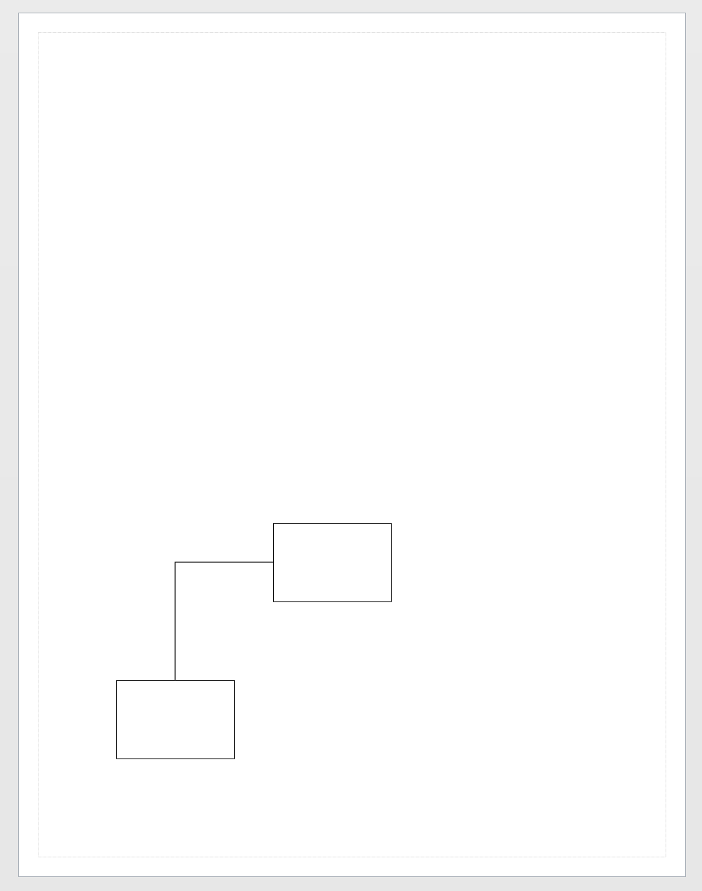

# Connect-VisioShape

Select two shapes and then use `Connect-VisioShape`

```
Import-Module Visio

New-VisioApplication
New-VisioDocument

$basic_u = Open-VisioDocument "basic_u.vss"
$rect_m = Get-VisioMaster -Name "Rectangle" -Document $basic_u
$dyncon_m = Get-VisioMaster -Name "Dynamic Connector" -Document $basic_u

$shape_0 = New-VisioShape -Master $rect_m -Position (New-VisioPoint 2 2)
$shape_1 = New-VisioShape -Master $rect_m -Position (New-VisioPoint 4 4)

Connect-VisioShape -From $shape_0 -To $shape_1 -Master $dyncon_m

```


