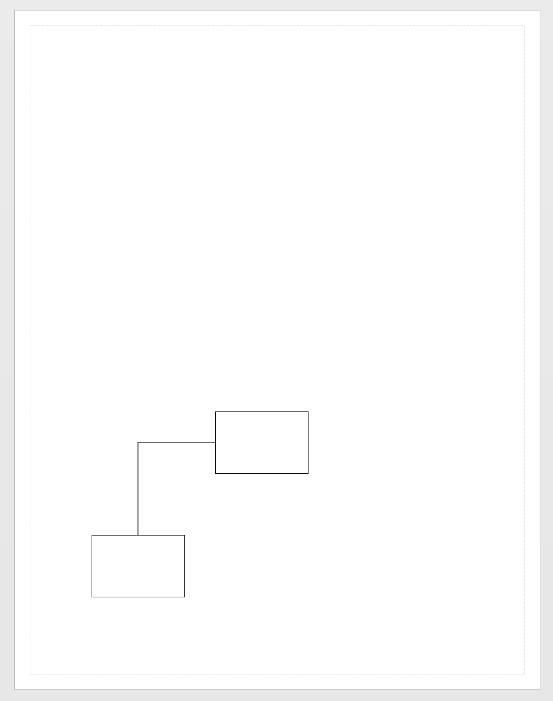

# Connect-VisioShape

Select two shapes and then use `New-VisioConnection`

```text
Import-Module Visio

New-VisioApplication
New-VisioDocument

$basic_u = Open-VisioDocument "basic_u.vss"
$rect_m = Get-VisioMaster -Name "Rectangle" -Document $basic_u
$dyncon_m = Get-VisioMaster -Name "Dynamic Connector" -Document $basic_u

$shape_0 = New-VisioShape -Masters $rect_m -Points 2.0,2.0
$shape_1 = New-VisioShape -Masters $rect_m -Points 4.0,4.0

Connect-VisioShape -From $shape_0 -To $shape_1 -Master $dyncon_m

```



