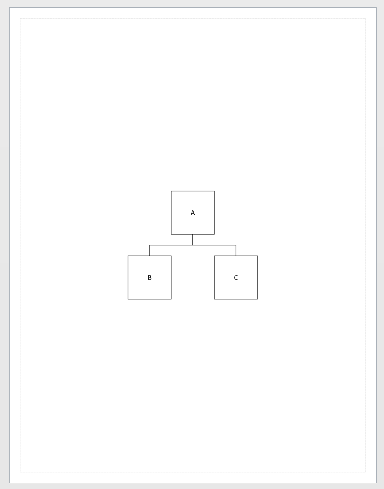

# Format-VisioPage

### Change the Page size

```
Format-VisioPage -Width 10.0 -Height 4.0
```

### Resize a page to fit its contents <a id="resize-a-page-to-fit-its-contents"></a>

```text
Format-VisioPage -FitContents
```

You may want some extra padding

```text
Format-VisioPage -FitContents -BorderWidth 1.0 -BorderHeight 1.0
```

### Page orientation <a id="page-orientation-and-background"></a>

```text
Format-VisioPage -Orientation Portrait

Format-VisioPage -Orientation Landscape
```

Visio has a feature on the DESIGN tab that can re-layout objects on a page.


```text
Set-StrictMode -Version 2
$ErrorActionPreference = "Stop"

import-module Visio

New-VisioDocument

$shape_a = New-VisioShape Rectangle 5,7,6,8
Set-VisioText "A"
$shape_b = New-VisioShape Rectangle 3,5,4,6
Set-VisioText "B"
$shape_c = New-VisioShape Rectangle 7,5,8,6
Set-VisioText "C"

Connect-VisioShape $shape_a $shape_b
Connect-VisioShape $shape_a $shape_c

$sc = Get-VisioScriptingClient
$sc.Assemblies | %{ Add-Type -Path $_ }

$ls = New-Object VisioAutomation.Models.LayoutStyles.FlowchartLayoutStyle
$ls.AvenueSizeX = 1
$ls.AvenueSizeY = 0.5

Format-VisioPage -LayoutStyle $ls
```



