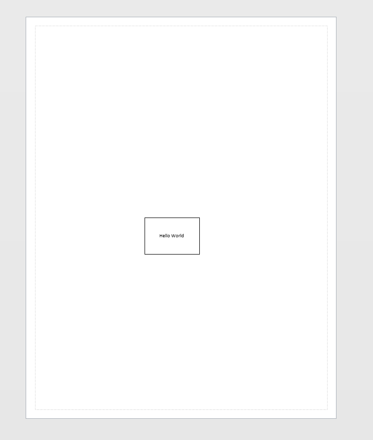

# Quick start

VisioPS is available on the PowerShell Gallery here: You can find the project here [**https://www.powershellgallery.com/packages/Visio/**](https://www.powershellgallery.com/packages/Visio/). 

Use `Install-Module` to install VisioPS from the PowerShell Gallery. 

```text
# Install-Module comes with PowerShell 5.0
# Does not need Administrator rights
Install-Module Visio -Scope CurrentUser    
```

If you are new to PowerShell, run these two commands to assist in debugging your scripts.

```text
Set-StrictMode -Version 2
$ErrorActionPreference = "Stop"
```

The following script introduces many basic concepts.

```text
Import-Module Visio

New-VisioApplication
New-VisioDocument

$basic_u = Open-VisioDocument "basic_u.vss"
$master = Get-VisioMaster "Rectangle" -Document $basic_u
$points = New-Object VisioAutomation.Geometry.Point(4,5)
$shape = New-VisioShape -Master $master -Position $points

Set-VisioText "Hello World" -Shape $shape
```



Here's what's happening in that script:

* `New-VisioApplication` starts Visio
* `New-VisioDocument` creates a new Visio document - this document will have one page with no shapes on it
* `Open-VisioDocument` loads the "Basic Shapes" stencil
* `Get-VisioMaster` retrieves a the "rectangle" master from the Basic Shapes stencil
* The variable `$p` is defined to be geometric point built from `New-Object VisioAutomation.Geometry.Point(4,5)`
* `New-VisioShape` creates a shape based by "dropping" the "Rectangle" master on the page at the position specified by `$points`- the units are always in inches. This shape will be selected once it is drawn.
* `Set-VisioText` sets the text of the active selection - which will be the shape that was dropped in the previous step

