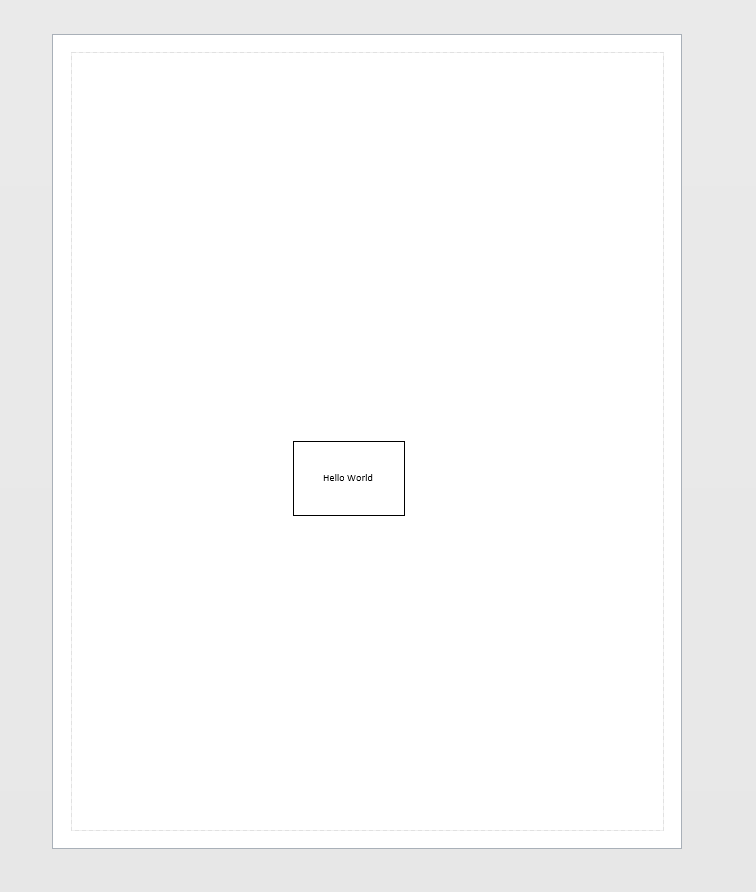

# Quick start

Use `Install-Module` to install the latest VisioPowerShell module from the PowerShell Gallery. By setting the Scope to **CurrentUser**, it avoids needing administrator rights.

```powershell
Install-Module Visio -Scope CurrentUser    
```

Run the following code to launch visio and draw a shape in a new document.

```powershell
Import-Module Visio

New-VisioApplication
New-VisioDocument

$basic_u = Open-VisioDocument "basic_u.vss"
$master = Get-VisioMaster "Rectangle" -Document $basic_u
$points =  New-VisioPoint 4 5
$shape = New-VisioShape -Master $master -Position $points

Set-VisioText "Hello World" -Shape $shape
```



Here's what's happening in that script:

* `New-VisioApplication` starts Visio
* `New-VisioDocument` creates a new Visio document - this document will have one page with no shapes on it
* `Open-VisioDocument` loads the "Basic Shapes" stencil
* `Get-VisioMaster` retrieves the "rectangle" master from the Basic Shapes stencil
* The variable `$points` is defined to be a geometric point built from `New-VisioPoint 4 5`&#x20;
* `New-VisioShape` creates a shape based by "dropping" the "Rectangle" master on the page at the position specified by `$points`- the units are always in inches. This shape will be selected once it is drawn.
* `Set-VisioText` sets the text of the active selection - which will be the shape that was dropped in the previous step
