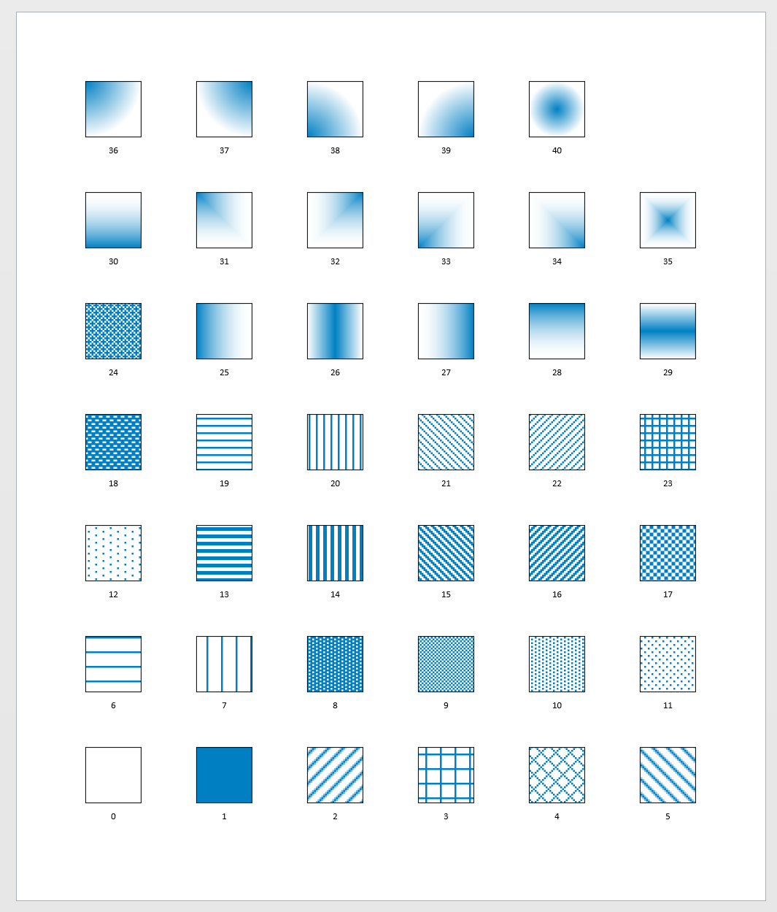

# Draw all fill patterns - slow


```text

Set-StrictMode -Version 2
$ErrorActionPreference = "Stop"

Set-StrictMode -Version 2
$ErrorActionPreference = "Stop"

$numcols = 6
$cellsep = 1.0
$cellwidth=1

Import-Module Visio

New-VisioApplication
New-VisioDocument

$d = $cellwidth + $cellsep
for ($i=0;$i -le 40;$i++) 
{
    $x = $i % $numcols 
    $y = [math]::floor($i / $numcols )
    $left = $x*$d
    $bottom = $y*$d
    $right = $left + $cellwidth
    $top = $bottom + $cellwidth

    $shape1_cells = New-VisioShapeCells
    $shape1_cells.FillForeground = "rgb(0,128,195)"
    $shape1_cells.FillBackground = "rgb(255,255,255)"
    $shape1_cells.FillPattern = $i

    $shape2_cells = New-VisioShapeCells
    $shape2_cells.FillPattern = 0
    $shape2_cells.LinePattern = 0

    $s1 = New-VisioShape -Type Rectangle $left,$bottom,$right,$top
    $s2 = New-VisioShape -Type Rectangle $left,($bottom-0.5),$right,$bottom
    Set-VisioText $i -Shapes $s2
    Set-VisioShapeCells -Cells $shape1_cells -Shapes $s1
    Set-VisioShapeCells -Cells $shape2_cells -Shapes $s2
}

Format-VisioPage -BorderWidth 1.0 -BorderHeight 1.0 -FitContents
```



