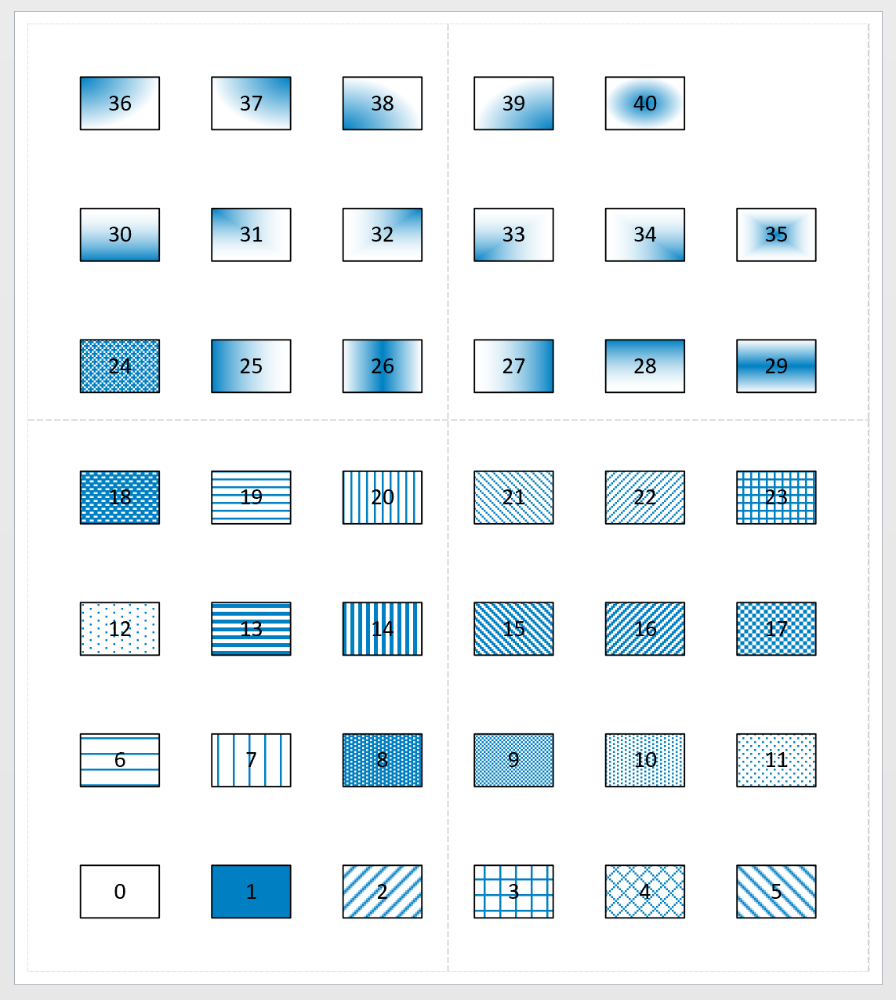

# Draw fill patterns - fast


## Draw an grid - more efficient <a id="draw-an-grid---more-efficient"></a>

```text
Set-StrictMode -Version 2
$ErrorActionPreference = "Stop"

$numcols =  [double] 6
$cellsep =  [double] 1.0
$cellwidth = [double] 1.5

Stop-Process -Name "Visio" -ErrorAction Ignore 

Import-Module Visio

New-VisioApplication
New-VisioDocument

$basic_u = Open-VisioDocument "basic_u.vss"
$rect_master = Get-VisioMaster "Rectangle" $basic_u

$patterns_masters = New-Object System.Collections.ArrayList  
$patterns_xys = New-Object System.Collections.ArrayList  
$patterns_shapecells = New-Object System.Collections.ArrayList  

$d = $cellwidth + $cellsep
for ($i=0;$i -le 40;$i++) 
{
    $x = [double] $i % $numcols 
    $y = [math]::floor($i / $numcols )
    $left = $x*$d
    $bottom = $y*$d
    $right = $left + $cellwidth
    $top = $bottom + $cellwidth

    $pinx = $left + ($cellwidth/2.0)
    $piny = $bottom + ($cellwidth/2.0)

    $patterns_masters.Add( $rect_master ) | Out-Null
    $patterns_xys.Add( $pinx ) | Out-Null
    $patterns_xys.Add( $piny ) | Out-Null

    $shape1_cells = New-VisioShapeCells
    $shape1_cells.FillForeground = "rgb(0,128,195)"
    $shape1_cells.FillBackground = "rgb(255,255,255)"
    $shape1_cells.FillPattern = $i
    $shape1_cells.CharSize = "32pt"
    $shape1_cells.LineWeight = "2pt"

    $patterns_shapecells.Add( $shape1_cells ) | Out-Null
}


$patterns_shapes = New-VisioShape -Masters $patterns_masters -Points $patterns_xys

for ($i=0;$i -le 40;$i++) 
{
    Set-VisioText -Shapes $patterns_shapes[$i] -Text $i
}
Set-VisioShapeCells -Shapes $patterns_shapes -Cells $patterns_shapecells

Format-VisioPage -BorderWidth 1.0 -BorderHeight 1.0 -FitContents
```



