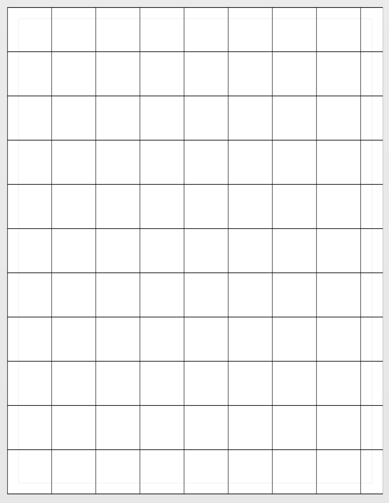
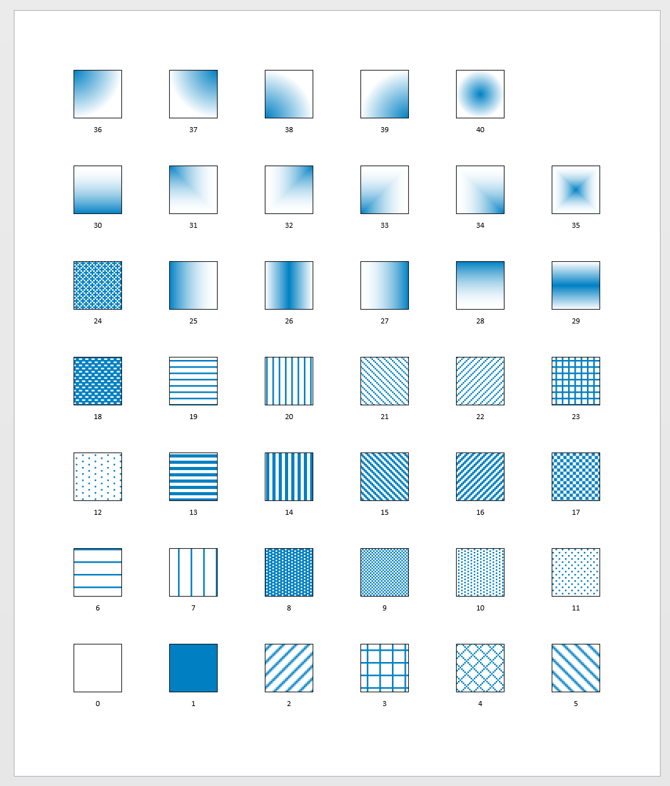

# Draw grid

## Draw a grid - Manual <a id="draw-an-grid---manual"></a>

```text
Set-StrictMode -Version 2
$ErrorActionPreference = "Stop"

Import-Module Visio

New-VisioApplication
New-VisioDocument

# Draw the vertical lines
for ($x=0; $x -le 8.5; $x++) 
{ 
    New-VisioShape -Type Line $x,0,$x,11 
}

# Draw the horzontal lines
for ($y=0; $y -le 11; $y++) 
{ 
    New-VisioShape 0,$y,8.5,$y 
}
```





##  <a id="draw-an-grid---more-efficient"></a>

