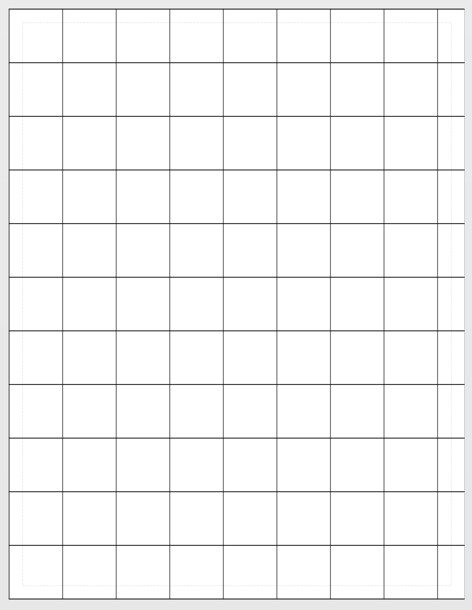
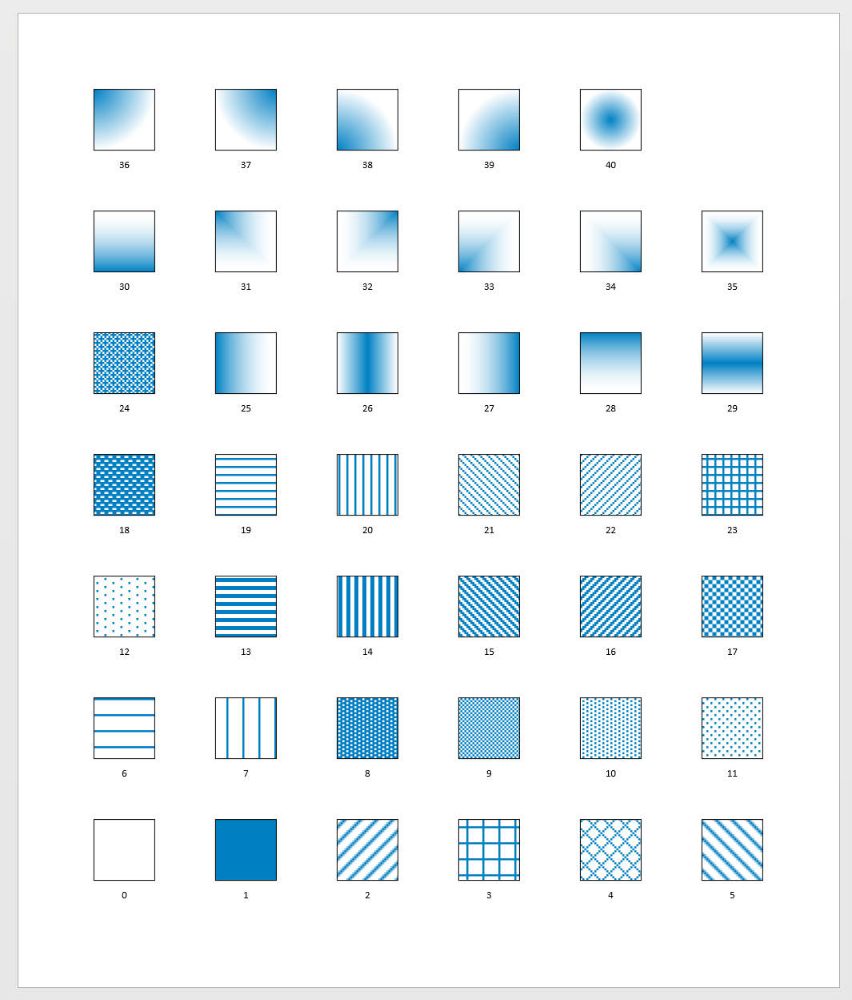

# Draw grid

## Draw a grid - Manual <a href="#draw-an-grid---manual" id="draw-an-grid---manual"></a>

```
Set-StrictMode -Version 2
$ErrorActionPreference = "Stop"

Import-Module Visio
New-VisioApplication
New-VisioDocument

# Draw the vertical lines
for ($x=0; $x -le 8.5; $x++) 
{ 
    $pfrom = New-VisioPoint $x 0
    $pto = New-VisioPoint $x 11
    New-VisioShape -Line -From $pfrom -To $pto 
}

# Draw the horzontal lines
for ($y=0; $y -le 11; $y++) 
{ 
    $pfrom = New-VisioPoint 0 $y
    $pto = New-VisioPoint 8.5 $y 
    New-VisioShape -Line -From $pfrom -To $pto 
}
```





## &#x20;<a href="#draw-an-grid---more-efficient" id="draw-an-grid---more-efficient"></a>
